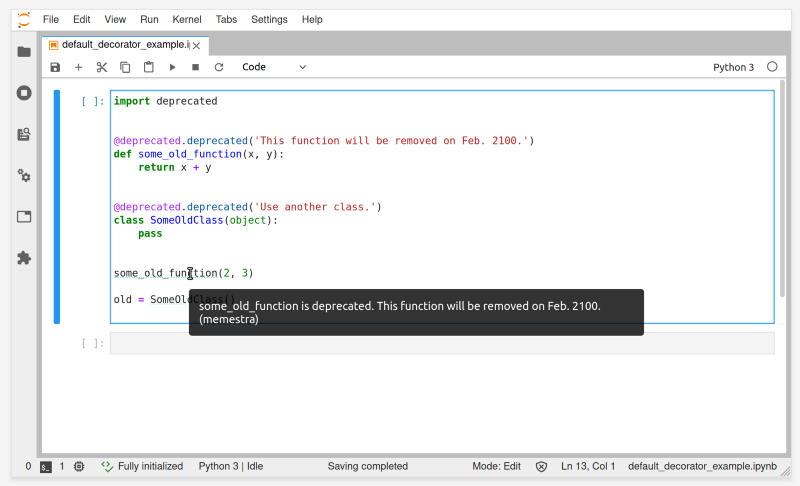

# pyls-memestra

[](https://mybinder.org/v2/gh/QuantStack/pyls-memestra/master?urlpath=/lab/tree/binder/example.ipynb)

> [Memestra](https://github.com/QuantStack/memestra/) plugin for the [Python Language Server](https://github.com/palantir/python-language-server)



# Installation

## From pip

`pip install pyls-memestra`

## From Mamba

`mamba install -c conda-forge pyls-memestra`

## From Conda

`conda install -c conda-forge pyls-memestra`

## From source

```bash
git clone git@github.com:QuantStack/pyls-memestra.git
cd pyls-memestra
python -m pip install -e .
```

# For a development environment

1. install python

    ```
    conda install -c conda-forge python=3
    ```

2. install JupyterLab

    ```bash
    conda install -c conda-forge 'jupyterlab>=2,<2.1.0a0'
    ```

3. install the server extension:

    ```bash
    pip install jupyter-lsp
    ```

4. install `nodejs`

    ```bash
    conda install -c conda-forge nodejs
    ```

5. install the frontend extension:

    ```bash
    jupyter labextension install @krassowski/jupyterlab-lsp           # for JupyterLab 2.x
    # jupyter labextension install @krassowski/jupyterlab-lsp@0.8.0   # for JupyterLab 1.x
    ```

6. install python language server:

    ```bash
    conda install -c conda-forge python-language-server
    ```

7. install [Memestra](https://github.com/QuantStack/memestra):

    ```bash
    pip install memestra
    ```

8. install the plugin

    ```bash
    python -m pip install -e .
    ```
